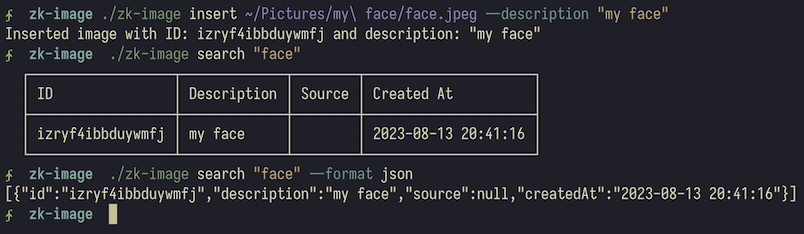

# `zk-image`

Small CLI tool that creates a folder with images and DB for it. Also returns a JSON serialized
list of images based on search term. Used for zettelkasten notes, best with
`zk` and `telescope.nvim` integration.

## Usage

## Why?

[Full reasoning and idea in a blog post.](https://example.org)
